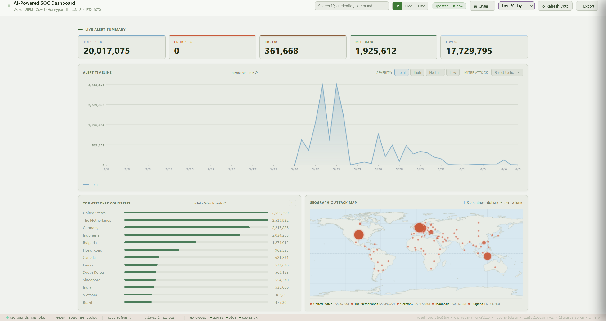

# AI-Powered SOC Pipeline

**CMU MSISPM Portfolio — Project 4**
Tyce Erickson · May 2026

A production-grade, AI-powered Security Operations Center pipeline built on real internet
attack data. Three honeypots exposed to the public internet collect live attack traffic
across SSH, web, and malware-capture vectors. Data is processed through a Wazuh SIEM,
enriched with geolocation and VirusTotal threat intelligence, and analyzed by a
locally-hosted large language model. A custom real-time dashboard provides 12 integrated
threat-intelligence panels across three honeypot sources. Which is currently still live and collecting data in real time.

**This is not a simulation. Every alert in this dataset came from a real attacker.**

## 🎥 Live Demo

[](https://youtu.be/YOUR_VIDEO_ID "Watch the 3-minute demo")

**▶ [Watch the 3-minute walkthrough](https://youtu.be/YOUR_VIDEO_ID)** — a live tour of the dashboard running on real honeypot data: attack timeline and geographic map, behavioral botnet fingerprinting, VirusTotal-verified WannaCry malware capture, cross-honeypot threat-actor correlation, and on-demand AI threat analysis.

## Live Stats (collection window May 21–29, 2026)

| Metric | Value |
|--------|-------|
| Total Wazuh alerts | 11,611,908 (~11.6M) |
| Cowrie SSH/Telnet events | 872,871 |
| nginx web requests | 1,352+ |
| Malware binaries captured | 7 (6 WannaCry + 1 downloader, VirusTotal-verified) |
| Unique attacker IPs | 1,000+ |
| Countries observed | 99 |
| Active botnets identified | 6 |
| MITRE ATT&CK techniques | 27 (across ~12 tactics) |
| Peak day | ~2.8M alerts / 24h |

> **Detection ruleset rebuilt June 2026.** The custom rule set was re-engineered for accurate, per-behavior MITRE ATT&CK mapping (57 rules, 27 techniques across ~12 tactics — see below). The historical alert totals above reflect the original May 21–29 collection window; going forward the system tags each event with its single correct technique/tactic instead of indexing raw session-lifecycle noise, so day-to-day alert *counts* are lower but every alert is meaningful and actionable.

## Architecture

```
Internet Attackers
        │
        ▼
[DigitalOcean VPS — NYC1]                    [Alienware m16 R2]
  Cowrie SSH/Telnet Honeypot                   Ollama + llama3.1:8b
  nginx Web Honeypot                           RTX 4070 (8GB VRAM)
  Dionaea Malware Capture
        │                                              │
        │ rsync / 5–15 min per honeypot (Tailscale)    │ HTTP API (Tailscale)
        ▼                                              │
[Ubuntu Server — aarch64]                              │
  Wazuh SIEM + OpenSearch                               │
  GeoIP + VirusTotal Enrichment                         │
  forward_cowrie.py + parse_nginx.py + parse_dionaea.py │
  Flask SOC Dashboard ──────────────────────────────────┘
        │
        ▼
  Browser (Tailscale only)
  http://<tailscale-ip>:5000
```

Three machines connected via Tailscale mesh VPN. The dashboard is **not** accessible from
the public internet. Credentials are supplied via environment variables, never stored in source.

## Dashboard

The custom Flask dashboard provides **12 real-time intelligence panels** across three sections.

### Cowrie SSH Honeypot
| Panel | Description |
|-------|-------------|
| Alert Timeline | Time series with severity and MITRE ATT&CK overlay |
| Geographic Attack Map | Natural Earth world map with volume-scaled attack dots |
| Attack Chain Funnel | Kill-chain dropout: Connect → KEX → Login → Commands → Downloads |
| Attack Velocity | Real-time attacks/min with 60-min spark chart |
| Attack Heatmap | 14-day hour × day intensity grid |
| Botnet Fingerprints | Auto-detected campaigns with timelines and on-click AI analysis |
| Credential Intelligence | Success rates, coordinated-attack detection, botnet badges |
| Attacker Intelligence | Threat-scored attackers with full session breakdown |
| MITRE ATT&CK Framework | Dynamic tactic/technique mapping from live alert data |
| On-Demand AI Analysis | llama3.1:8b summary, full, and executive triage modes |

### Multi-Honeypot & Correlation (nginx + Dionaea)
| Panel | Description |
|-------|-------------|
| Dionaea Malware Capture | Captured binaries with **VirusTotal verdict, malware family, source attribution, file size**, service breakdown, and activity timeline |
| nginx Web Honeypot | Scanner fingerprints, CVE probe paths, user agents, request timeline |
| Cross-Honeypot Attackers | IPs seen attacking multiple honeypots simultaneously |
| **Threat Actor Correlation** | Unified per-IP profiles across all three honeypots, ranked by composite threat score — links SSH, web, and malware activity into single coordinated-actor views |

### Incident Management
Built-in case management (open/investigating/closed, severity, audit log), alert pivoting
and search, and five response playbooks — backed by a local SQLite store (`schema.sql`).

## Key Findings

### Live WannaCry Capture
The Dionaea honeypot captured **7 unique malware binaries** over SMB — **6 confirmed
WannaCry ransomware variants** (59–66 of ~76 VirusTotal engines flagging each) plus one
trojan downloader — delivered from source IPs in the United States, Thailand, Sri Lanka, and
Vietnam. Each sample is SHA256-hashed, VirusTotal-verified, attributed to its source, and
preserved in a permanent read-only archive. WannaCry still self-propagating over exposed SMB
years after 2017 is a concrete demonstration of long-tail internet threat activity.

### The mdrfckr Botnet
The most sophisticated campaign observed. Installs a persistent SSH backdoor via
`~/.ssh/authorized_keys` using a distinctive RSA key ending in `mdrfckr`, then uses
`chattr -ia` (immutable flag) to prevent key removal even by root. ~90,000 implant attempts
in the collection window from hundreds of distributed IPs.

### The 345gs5662d34 Campaign
Massive credential stuffing using `root/345gs5662d34` — attempted **103,084 times from 357
unique IPs**, the largest single-credential effort in the dataset.

### nginx Web Honeypot
Requests probing hundreds of unique paths: IoT botnets, `.env` credential theft targeting
SendGrid/Twilio API keys, Hikvision CVE-2021-36260 RCE probes, TP-Link firmware exploits
(CVE-2021-22161), and Tomcat manager brute-force.

### Attack Scale
At peak, a single day saw **~2.8 million alerts**, driven by overlapping botnet campaigns. Across the 6-day capture the system averaged roughly 1.9 million alerts/day — on the order of 20+ attack events every second at sustained volume.

## Repository Structure

```
ai-soc-pipeline/
├── dashboard/
│   ├── app.py                       # Flask backend — 16 API endpoints
│   ├── schema.sql                   # Incident-management SQLite schema
│   └── templates/
│       └── index.html               # SOC dashboard frontend (12 panels)
├── pipeline/
│   ├── parse_nginx.py               # nginx CLF → Wazuh JSON parser (wraps events as {"data":{...}})
│   ├── parse_dionaea.py             # Dionaea SQLite → Wazuh JSON; SHA256 + VirusTotal + archive
│   ├── forward_cowrie.py            # wraps Cowrie events as {"data":{...}} and appends to the Wazuh feed
│   ├── sync_cowrie.sh               # VPS → SIEM cowrie sync (rsync --append + unreachable/rotation guard) → forward
│   ├── sync_nginx.sh                # VPS → SIEM nginx access.log sync (homeserver-owned) → parse
│   ├── sync_dionaea.sh              # VPS → SIEM sync (SQLite + binaries), then parse
│   └── rebuild_geoip_cache.py       # MaxMind GeoLite2 cache refresh
├── triage/
│   ├── ai_triage.py                 # LLM threat-analysis engine
│   ├── alert_poller.py              # OpenSearch alert sampler
│   └── triage_runner.py             # 30-min cron orchestrator
├── scripts/
│   └── resolve_alert_ips.py         # GeoIP backfill for alert IPs
├── config/
│   ├── soc-dashboard.service        # Dashboard systemd unit
│   ├── cowrie-sync.service          # Cowrie sync+forward systemd unit
│   ├── cowrie-sync.timer            # 5-min timer for cowrie sync
│   ├── nginx-sync.service           # nginx sync+parse systemd unit
│   ├── nginx-sync.timer             # 5-min timer for nginx sync
│   ├── dionaea-sync.service         # Dionaea sync+parse systemd unit
│   ├── dionaea-sync.timer           # 15-min timer for the above
│   ├── geoip-enrich.cron            # Hourly enrichment cron
│   ├── wazuh-cowrie-rules.xml       # Cowrie detection rules (100100–100191, 29 rules)
│   ├── wazuh-honeypot-web-rules.xml # Dionaea + nginx rules (100200–100344, 28 rules)
│   ├── ingest-pipeline-filebeat-wazuh-alerts.json  # OpenSearch ingest pipeline (data.data flatten fix)
│   ├── mitre-db-fixes.sql           # Wazuh MITRE-DB tactic-mapping fix (re-apply after upgrades)
│   └── wazuh-ossec-snippet.xml      # Wazuh agent localfile config
├── docs/                            # 01–09 + operations runbook
├── data/samples/                    # Sample alert JSON for testing
├── requirements.txt
└── README.md
```

## API Endpoints

| Endpoint | Description |
|----------|-------------|
| `GET /api/stats?minutes=N` | Full stats: timeline, countries, IPs, MITRE, credentials, commands |
| `GET /api/attack_chain?minutes=N` | Kill-chain funnel stage counts |
| `GET /api/velocity` | Real-time attacks/min + 60-min spark data |
| `GET /api/heatmap` | 14-day hour × day attack matrix |
| `GET /api/sessions?minutes=N` | Top sessions with full event chains |
| `GET /api/botnets?minutes=N` | Behavioral botnet fingerprints |
| `GET /api/intel?minutes=N` | Parallel: attack chain + sessions + botnets + cred_intel |
| `GET /api/cred_intel?minutes=N` | Credential success rates + coordination detection |
| `POST /api/botnet_analysis` | AI analysis of a specific campaign |
| `GET /api/dionaea?minutes=N` | Dionaea malware stats + VirusTotal-enriched binaries |
| `GET /api/nginx?minutes=N` | nginx web honeypot stats |
| `GET /api/honeypots?minutes=N` | Combined Dionaea + nginx (parallel) |
| `GET /api/threat_actors?minutes=N` | Cross-honeypot threat-actor correlation |
| `GET /api/alert/<ip>` | Full alert/context drawer for a source IP |
| `GET /api/search?q=&type=` | Pivot/search across IPs, credentials, commands |
| `GET /api/cases` · `POST /api/cases` · `PATCH /api/cases/<id>` | Incident case management |
| `GET /api/playbooks` | Response playbooks |
| `GET /api/triage` · `POST /api/analysis/run` | AI triage report / on-demand analysis |

## Technology Stack

- **Honeypots:** Cowrie SSH/Telnet, nginx, Dionaea (Docker on DigitalOcean NYC1)
- **Transport:** rsync over Tailscale VPN — homeserver-owned systemd timers per honeypot (cowrie & nginx every 5 min, dionaea every 15 min)
- **Enrichment:** Python + MaxMind GeoLite2 (City + ASN) + VirusTotal API (hash-only)
- **Log parsers:** custom Python for nginx CLF and Dionaea SQLite
- **SIEM:** Wazuh 4.x + OpenSearch (Ubuntu Server, aarch64)
- **Backend:** Python 3, Flask (minimal dependencies — `flask`, `geoip2`)
- **Frontend:** vanilla HTML/CSS/JS, HTML5 Canvas, Natural Earth 50m geodata
- **AI:** Ollama + llama3.1:8b on NVIDIA RTX 4070 (fully local inference)
- **Network:** Tailscale mesh VPN (no public dashboard exposure)
- **Secrets:** environment-variable based; no credentials in source

## Setup

See `docs/02-wazuh-installation.md` for full deployment instructions. High-level steps:

1. Deploy Cowrie, nginx, and Dionaea on a VPS (Docker Compose)
2. Install Wazuh all-in-one on your SIEM server
3. Configure key-based sync from VPS → SIEM server via Tailscale
4. Deploy the three homeserver-owned sync timers — `cowrie-sync.timer` (`sync_cowrie.sh` + `forward_cowrie.py`), `nginx-sync.timer` (`sync_nginx.sh` + `parse_nginx.py`), `dionaea-sync.timer` (`sync_dionaea.sh` + `parse_dionaea.py`). Each rsyncs its honeypot's data from the VPS over Tailscale and emits `{"data":{...}}`-wrapped Wazuh JSON.
5. Set up GeoIP enrichment cron (`config/geoip-enrich.cron`)
6. Add Wazuh rules (`config/wazuh-cowrie-rules.xml`, `config/wazuh-honeypot-web-rules.xml`)
7. Import the OpenSearch ingest pipeline (`config/ingest-pipeline-filebeat-wazuh-alerts.json`) and apply `config/mitre-db-fixes.sql` to the Wazuh MITRE DB (re-apply the latter after any Wazuh upgrade — see `docs/operations.md`)
8. Deploy the Flask dashboard (`config/soc-dashboard.service`); set `OPENSEARCH_PASS` in the unit
9. (Optional) set `VT_API_KEY` in `config/dionaea-sync.service` to enable VirusTotal enrichment
10. Install Ollama and pull `llama3.1:8b` on your AI inference machine

## Documentation

Full project documentation is in `docs/`:

1. **Architecture** — system design, data flow, infrastructure
2. **Wazuh Installation** — SIEM deployment and configuration
3. **Log Ingestion** — pipeline from honeypot to SIEM
4. **Custom Rules** — decoders, rules, MITRE mapping
5. **AI Triage Design** — LLM integration and prompt engineering
6. **Dashboard Guide** — panel reference and interpretation
7. **Alert Samples** — real attack session analysis
8. **Lessons Learned** — technical retrospective (incl. the Dionaea schema bug and secrets-handling migration)
9. **Executive Summary** — CISO-level findings and significance

Plus **Operations Runbook** (`docs/operations.md`) — automated ingestion topology, the non-git artifacts to re-apply after rebuilds/upgrades (ingest pipeline, MITRE-DB fix, fail2ban whitelist), and resilience safeguards.

---

*Built as Project 4 of 4 for a CMU MSISPM application portfolio. All data collected from real
internet attack traffic on infrastructure owned and operated by the author.*
